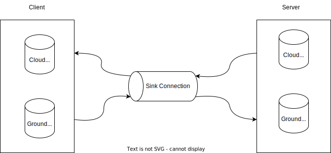

# Sink

A protocol for synchronizing event based systems over unreliable connections.

## Target Audience

Sink was originally designed to synchronize data between IoT devices and cloud servers. IoT devices may lose connections or power at any time so Sink handles reliably and efficiently transferring data between client and server. However if you have two non-IoT systems that need to communicate changes Sink or a Sink like approach may work as well.

## Disclaimer

There are several known breaking protocol changes coming (see issues list) and there may be more before Sink reaches 1.0. Migration should be easy, but may involve running multiple protocol versions at once. More on that as it evolves...

## Requirements

* Elixir ~> 1.12

## Installation

Todo

## How Sink Works

Sink has 3 components
* The protocol and connection handling (this repo)
* A durable event log (not included)
* Durable event subscriptions which point to offsets in event logs (not included)

One way to think about Sink is as durable, at-least-once pub-sub. As a system goes about its day to day life it generates events and writes them to an event log. An event log may have one or more Sink subscriptions These subscriptions track which events have been acknowledged by the desired consumers. The consumer can be an internal process or a network connected device.

Event logs and subscriptions might be stored in a data store such as SQLite, CubDB, a flat file, etc. Support for pluggable Sink backends is a future feature. SparkMeter has Sink backends for SQLite and Postgres, but these are not currently open source.

## Usage

Example uses of Sink are [here](https://github.com/sparkmeter/sink_examples).

### Ground and Cloud Event Logs

Typically there is a ground event log and a cloud event log.

The ground event log is used to store events generated by a client on the ground. For example, if the client device is an IoT sensor you would write sensor readings as events to the ground event log. An event subscription tracks what offset has been sent to the cloud for each event_type_id-key. These events are then transmitted via Sink from the ground event log on the client to the ground event log on the server for that client.

The cloud event log is used to store events generated by the server in the cloud. Typically the events in the cloud event log are configuration values for the device(s) on the ground. Events from the cloud are transmitted to one or more clients.

Because a client only generates ground events and a server only generates cloud events there are no shared resources to cause concurrency issues. This does mean that the state of the system may be different depending on if it is viewed in the ground or the cloud, though. Arguably, this is a better reflection of reality anyways and forces the programmer acknowledge the realities of a distributed system.

### Authentication

Sink uses mutual TLS authentication to set up a connection and to determine which client a server is talking to. There are hooks on the server side to authenticate or reject a client. Currently unknown clients are not handled well, so be aware of that if you plan to try out Sink. There is an issue to track this and the solution.

### ACKs and NACKs

Read more about the protocol [here](docs/protocol.md).

### Client Side

To set up a Sink client you will need:
* A place that you store a SSL public and private key-pair. Each key-pair is unique per client.
* One or more CA certs for the server(s) you plan to connect to.
* A ground event log.
* A cloud event log.
* An outgoing event subscription to track and handle which ground events you want to transmit.
* A module that implements the `Sink.Connection.Handler` interface

### Server Side

To set up a Sink server you will need:
* A place that you store a SSL public and private key-pair for the server.
* A place that you store the certificates for each client. These are used to authenticate each client.
* A cloud event log.
* A ground event log.
* An outgoing event subscription to track and handle which ground events you want to transmit and to which client.
* A module that implements the `Sink.Connection.ServerConnectionHandler` interface

## Frequently-Asked Questions

### What is an "offset"? Why does Sink use them?

Offsets in Sink are similar to offsets in Kafka in that they are integers that increase to track changes to underlying events. Typically each event type id and key would start at offset 1 and increment for each new event. The offset is used as a reference by subscriptions to determine what events have been sent and what events still need to be sent. They can also double as audit logs or store references to offsets of other events.

### I saw your talk at ElixirConf 2021 and you said something different than what is here. What gives?

Distributed event based systems are hard. Sink aims to make that easier, but some of the work mentioned there hasn't made it into production yet. It's coming, though.